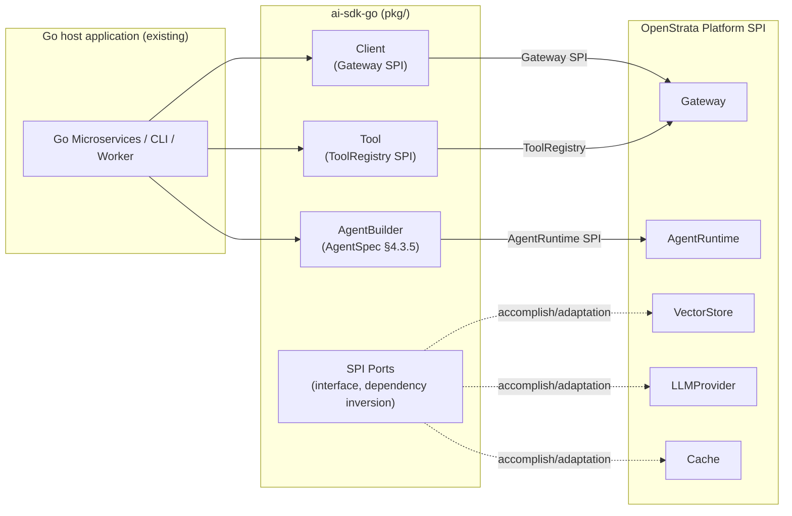
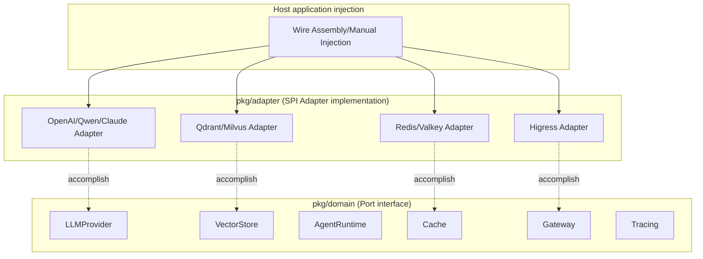
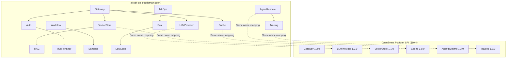
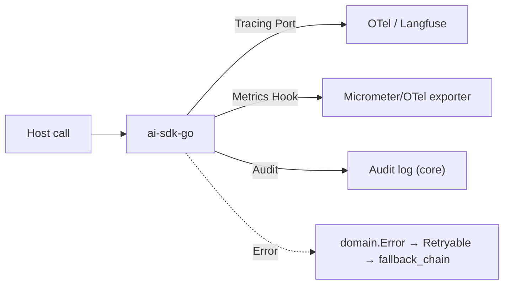

# ai-sdk-go · DESIGN

> This file is the **detailed design document** of `ai-sdk-go`, covering and replacing the original placeholder skeleton of `design/DESIGN.md`.
> It co-evolves with the main repository `arch/` (architecture positioning), `skills/` (AI coding skills), `specs/` (contract), and major decisions are recorded as ADRs in `design/adr/`.
> `arch/` `skills/` `specs/` `README.md` is not within the scope of changes to this document.

| meta information | value |
| --- | --- |
| **repo** | ai-sdk-go |
| **Language·Framework** | Go/Gin + Cobra + Wire (hot path Hertz/go-zero) |
| **domain** | sdk |
| **optional** | false (core, forced to be delivered with the platform) |
| **Platform version** | v1.4.0 (`strata v1.4.0`, released 2026-07-15) |
| **Document Status** | Draft |
| **Responsible Person** | OpenStrata Architecture Group |
| **Associated links** | [arch/ARCH.md](./../arch/ARCH.md) · [skills/SKILLS.md](./../skills/SKILLS.md) · [specs/SPECS.md](./../specs/SPECS.md) · Architecture documentation §4.3.5 / §4.4 / §10.4 / §10.6 / §12 / §15.5 / §16 |

---

## 1. Positioning and target users (application developers)

`ai-sdk-go` is a **developer library** published to **Go Module Proxy** (`github.com/openstrata/ai-sdk-go`, corresponding to Go module path `github.com/openstrata/ai-sdk-go`), and is not a deployable service.

- **What it solves**: Let Go developers build Agent/Client in their existing Go applications (microservices, CLI, background tasks) in a minimally intrusive way, and access the runtime capabilities of the OpenStrata platform (gateway, Agent runtime, tool registration, memory, RAG, cache, observability).
- **SDK is not a gateway, not a runtime ontology**: SDK is "client + builder + extension port" - it isolates the domain logic of the repository (AgentSpec construction, tool encapsulation, SPI port definition) and anti-corrosion calls to platform SPI under `pkg/`, and the host application only needs to rely on `pkg/`.
- **Target Users**:
1. **Go backend/platform engineer**: Embed conversational Agent in existing Go services, encapsulate internal capabilities into platform tools (Tools), and connect business data to RAG.
2. **Platform secondary developer**: Implement customized `LLMProvider` / `VectorStore` / `Cache` / `AgentRuntime` adapter based on the SPI port of the SDK, and inject it into the host application (dependency inversion, zero modification to the SDK core).
- **Relationship with §15.5**: SDK only relies on **Go standard library + a very small number of necessary dependencies** (such as `google/wire`, `gin`, `http`, `yaml`), ensuring that it can be embedded in any host application (§15.5.1 Framework Convergence Principle). The host application can choose Gin/Hertz, and the SDK itself is not bound to the web framework.



---

## 2. Core abstraction and API surface (Agent / Client / Tool / Session, etc.)

The domain layer of the SDK only defines **Port (interface)**, which exposes 5 first-class citizen objects + N SPI port interfaces. All external APIs are located in the `pkg/` package (can be imported by the host), see §15.5.2 for the fourth layer of DDD.

### 2.1 Package structure (Go Module)

```
ai-sdk-go/
├── cmd/                           #Optional cli sample (aictl-go demo, not release subject)
├── pkg/                           #★ Release body (go module root package)
│   ├── client/                    #① Access layer: GatewayClient (OpenAI-compatible)
│   ├── agent/                     #② Application layer: AgentBuilder/Runner orchestration
│   ├── domain/                    #③ Domain layer: AgentSpec / Tool / Session entity + Port interface
│   ├── adapter/                   #④ Infrastructure layer: SPI Adapter (LLMProvider/VectorStore/Cache…)
│   └── config/                    #Configuration loading (infrastructure/config fragment rendering)
├── infrastructure/config/         #This repository SPI adapter local configuration fragment
└── arch/ design/ skills/ specs/   #Evolutionary AI Coding Source of Truth (immobile)
```

### 2.2 Core Objects

| Abstract | Role | Corresponding platform SPI / Contract | Description |
| --- | --- | --- | --- |
| `Client` | Gateway client | **Gateway** SPI (§4.4.1, OpenAI-compatible) | Encapsulates chat/embed/stream/rerank calls; holds tenant Token |
| `Agent` / `AgentBuilder` | AgentSpec builder | **AgentSpec** §4.3.5 / **AgentRuntime** SPI | Declarative binding `apiVersion/kind/metadata/model_binding/tool_bindings/memory_bindings/state_machine/guardrails` |
| `Tool` | Tool encapsulation | **ToolRegistry** (§4.3.2, MCP stdio/SSE/HTTP) | Declare JSON Schema, binding `tool_bindings`, can be local or registered to ToolRegistry |
| `Session` | Multi-round session/memory | **Cache** SPI (§4.3.4, session state) + memory_bindings | Client handle for short-term/long-term memory |
| `Retriever` | RAG retrieval | **VectorStore** SPI (§10.4) + **RAG** ​​SPI | Knowledge base retrieval, return hit fragments |

### 2.3 Domain layer Port interface (dependency inversion, corresponding to §15.5.4)

The domain layer defines the following **SPI port interface** in `pkg/domain`, and the name is strictly consistent with the §10.4 / §16 canonical port name**:

```go
package domain

//LLMProvider - corresponding platform LLMProvider SPI (§4.4.4), interface_versions: 1.0.0
type LLMProvider interface {
    Chat(ctx context.Context, req ChatRequest) (ChatResponse, error)
    Embed(ctx context.Context, req EmbedRequest) (EmbedResponse, error)
    Rerank(ctx context.Context, req RerankRequest) (RerankResponse, error)
    Stream(ctx context.Context, req ChatRequest) (<-chan StreamChunk, error)
}

//VectorStore - corresponding platform VectorStore SPI (§10.4), interface_versions: 1.1.0
type VectorStore interface {
    Upsert(ctx context.Context, col string, docs []Doc) error
    Search(ctx context.Context, col string, vec []float32, topK int) ([]Hit, error)
    Delete(ctx context.Context, col string, ids []string) error
}

//AgentRuntime —— Corresponding platform AgentRuntime SPI (§10.6 / §4.3.5), interface_versions: 1.3.0
type AgentRuntime interface {
    Load(ctx context.Context, spec *AgentSpec) (AgentHandle, error)
    Run(ctx context.Context, h AgentHandle, input map[string]any) (map[string]any, error)
}

//Cache - corresponding platform Cache SPI (§4.3.4), interface_versions: 1.0.0
type Cache interface {
    Get(ctx context.Context, key string) ([]byte, bool, error)
    Set(ctx context.Context, key string, val []byte, ttl time.Duration) error
}

//Gateway - corresponding platform Gateway SPI (§4.4.1), interface_versions: 1.2.0
type Gateway interface {
    Invoke(ctx context.Context, req GatewayRequest) (GatewayResponse, error)
}

//Tracing - corresponding platform Tracing SPI (§4.8), interface_versions: 1.0.0
type Tracing interface {
    StartSpan(ctx context.Context, name string) (context.Context, Span)
}

//Remaining ports (Auth/RAG/LowCode/Workflow/Sandbox/CICD/MultiTenancy/MLOps/Eval)
//The interface with the same name is exposed in pkg/domain. See §6 mapping table to ensure consistency with the platform.
```

> All port interfaces **do not contain any specific framework/external component dependencies** and comply with the §15.5.2 domain layer prohibition.



---

## 3. Installation and initialization (Install & bootstrap)

### 3.1 Installation

```bash
# Go 1.22+，module path Right now import prefix
go get github.com/openstrata/ai-sdk-go@v1.4.0
```

`go.mod` alignment: `require github.com/openstrata/ai-sdk-go v1.4.0`. The `go.mod` of the SDK only introduces the standard library + a small number of necessary dependencies (`google/wire`, `gin`, `yaml`, `otel`), without retransmitting dependencies to avoid contaminating the host application (§15.5.1).

### 3.2 Initialization (bootstrap)

The SDK is assembled via `config.Load()` from the `infrastructure/config/` fragment/environment variables/explicit `Option`. **Dependency Inversion + Wire Compilation Time Injection** is adopted by default; the host can also manually inject SPI implementation.

```go
package main

import (
    "github.com/openstrata/ai-sdk-go/pkg/client"
    "github.com/openstrata/ai-sdk-go/pkg/config"
    "github.com/openstrata/ai-sdk-go/pkg/adapter"
)

func main() {
    cfg, _ := config.Load(config.FromEnv(), config.FromFile("infrastructure/config/client.yaml"))

    //Default assembly: Higress(Gateway) + Qwen/OpenAI(LLMProvider) + Redis(Cache)
    c := client.New(
        client.WithGateway(adapter.NewHigressGateway(cfg.Gateway)),
        client.WithLLMProvider(adapter.NewOpenAICompatible(cfg.Model.Qwen)), //Third-party LLM (§4.4.4)
        client.WithCache(adapter.NewRedisCache(cfg.Cache)),
    )
    _ = c
}
```

> Phases 1 to 3 default to **third-party LLM API** (fill in the Key and use it, no GPU required, §4.4.2); `modelServing` (self-hosted vLLM/TGI) is only enabled in the full file, and the SDK switches seamlessly through the `LLMProvider` port (§4.4.4).

---

## 4. Key usage and code examples (Quickstart/Typical mode)

### 4.1 Quickstart: 30 minutes to run through the conversational Agent (corresponding to §11.2 Phase 1 MVP)

```go
package main

import (
    "context"
    "github.com/openstrata/ai-sdk-go/pkg/client"
    "github.com/openstrata/ai-sdk-go/pkg/agent"
    "github.com/openstrata/ai-sdk-go/pkg/adapter"
)

func main() {
    c := client.New(
        client.WithGateway(adapter.MustHigressFromEnv()),
        client.WithLLMProvider(adapter.MustQwenFromEnv()), //Fill in DASHSCOPE_API_KEY and use it
    )

    //Declare an AgentSpec with AgentBuilder (§4.3.5 Convergence Contract)
    spec := agent.NewSpec("customer-service-v2").
        WithTenant("tenant-b").
        WithModelBinding(agent.ModelBinding{
            Preferred:     "cloud-qwen-max",
            FallbackChain: []string{"local-qwen2.5-72b", "cloud-gpt-4o"},
        }).
        WithInputSchema(agent.ObjectSchema("query", "string")).
        WithOutputSchema(agent.ObjectSchema("answer", "string")).
        WithGuardrails(agent.Guardrails{Basic: []string{"injection_scan", "pii_scan", "rate_limit"}}).
        Build()

    //Loaded and run via AgentRuntime SPI (declarative, runtime-independent, §4.3.5)
    h, _ := c.AgentRuntime().Load(context.Background(), spec)
    out, _ := c.AgentRuntime().Run(context.Background(), h, map[string]any{"query": "Where's my order?"})
    println(out["answer"].(string))
}
```

### 4.2 Typical mode A: Register a custom Tool (MCP/ToolRegistry, §4.3.2)

```go
tool := agent.NewTool("order_lookup").
    WithDescription("Check order logistics status").
    WithInputSchema(agent.ObjectSchema("order_id", "string")).
    WithHandler(func(ctx context.Context, in map[string]any) (map[string]any, error) {
        return map[string]any{"status": "shipped"}, nil
    })

//tool_bindings binding to spec
spec = spec.WithToolBindings("order_lookup")
//Or register to the platform ToolRegistry (take Gateway SPI)
_ = c.Tools().Register(context.Background(), tool)
```

### 4.3 Typical mode B: RAG retrieval (VectorStore + RAG SPI, §10.4 / §4.5)

```go
//Retrieve VectorStore SPI; SDK factory returns Qdrant/Milvus Adapter according to tenant.vector_store_preference (§10.4)
hits, _ := c.VectorStore().Search(ctx, "kb-tenant-b", queryVec, 5)
//Hit fragments are backfilled to LLMProvider's prompt (RAG pipeline is composed by the platform, SDK only exposes the retrieval port)
```

### 4.4 Typical Mode C: Multiple rounds of Session/Memory (Cache SPI, §4.3.4)

```go
sess := c.Session("user-123")
sess.SetWorkingMemoryTTL(1 * time.Hour)              // working memory（§4.3.5 memory_bindings）
resp, _ := c.Chat(ctx, client.ChatInput{Session: sess, Message: "Remember my last name is Zhang"})
```

---

## 5. SPI / extension point (how to access custom LLM / VectorStore / Tool)

The **extension point of the SDK is the platform SPI port** (the name is consistent with the §10.4 canonical port name). The host application only needs to implement the corresponding `domain` interface and inject it to replace the default implementation - **zero changes to the SDK core** (dependency inversion + anti-corrosion layer ACL, §10.4 / §15.5.4).

### 5.1 Access custom LLMProvider (such as access to private inference)

```go
type MySelfHosted struct{ endpoint string }
func (m *MySelfHosted) Chat(ctx context.Context, req domain.ChatRequest) (domain.ChatResponse, error) {
    //Tune your own vLLM/TGI OpenAI-compatible endpoint
}
func (m *MySelfHosted) Embed(ctx context.Context, req domain.EmbedRequest) (domain.EmbedResponse, error) { /* ... */ }
func (m *MySelfHosted) Rerank(ctx context.Context, req domain.RerankRequest) (domain.RerankResponse, error) { /* ... */ }
func (m *MySelfHosted) Stream(ctx context.Context, req domain.ChatRequest) (<-chan domain.StreamChunk, error) { /* ... */ }

//Injection: replace the default LLMProvider (full file self-hosting scenario, §4.4.2)
c := client.New(client.WithLLMProvider(&MySelfHosted{endpoint: "http://vllm:8000"}))
```

### 5.2 Access custom VectorStore / Cache

Implement the `domain.VectorStore` / `domain.Cache` interface and inject it through `client.WithVectorStore(...)` / `client.WithCache(...)` respectively. Multiple implementations coexisting (Qdrant/Milvus, Redis/Valkey) are routed by the SDK factory according to `tenant.vector_store_preference` (§10.4 Runtime routing).

### 5.3 Access custom AgentRuntime / Tracing

Implements the `domain.AgentRuntime` / `domain.Tracing` interface and is injected through `client.WithAgentRuntime(...)` / `client.WithTracing(...)`. The SDK default implementation binds platform LangGraph (Python)/Spring AI (Java) instances, but the host can change the local map executor without changing the spec - because AgentSpec is declarative and has nothing to do with runtime (§4.3.5).

### 5.4 Complete list of SPI ports (strictly aligned with §10.4)

The SDK exposes all 15 types of port interfaces: `Gateway`, `AgentRuntime`, `LLMProvider`, `VectorStore`, `Cache`, `Auth`, `Tracing`, `RAG`, `LowCode`, `Workflow`, `Sandbox`, `CICD`, `MultiTenancy`, `MLOps`, `Eval`. See §6 mapping table.

---

## 6. Mapping with platform SPI (→ §10.4)

The SPI extension point of the SDK is **strictly mapped** to the SPI port of the platform §10.4; port name = canonical name, `interface_versions` is taken from `bom.yaml` §16. The following table is the complete traceback of SDK Realm Port → Platform SPI.

| SDK Domain Port (pkg/domain) | Platform SPI Port (§10.4 canonical) | interface_versions | SDK Roles | Default Adapter (bom.yaml) |
| --- | --- | --- | --- | --- |
| `Gateway` | **Gateway** | 1.2.0 | Production(invoke) | Higress(core) |
| `AgentRuntime` | **AgentRuntime** | 1.3.0 | Production (Load/Run) | LangGraph/Spring AI binding execution (core) |
| `LLMProvider` | **LLMProvider** | 1.0.0 | Production (chat/embed/rerank/stream) | Qwen-Cloud / OpenAI / Claude (core third party) |
| `VectorStore` | **VectorStore** | 1.1.0 | Production (upsert/search) | Qdrant (core)/Milvus (optional) |
| `Cache` | **Cache** | 1.0.0 | Production (semantic/accurate caching) | Redis (core)/Valkey (optional, OSI) |
| `Auth` | **Auth** | 1.0.0 | Consumption (tenant Token verification context) | Keycloak (core) |
| `Tracing` | **Tracing** | 1.0.0 | Production (span) | Langfuse (core) / OTel (core baseline) |
| `RAG` | **RAG** ​​| 1.0.0 | Consumption (retrieval backfill) | RAGFlow (core) |
| `LowCode` | **LowCode** | 1.0.0 | Consumption (canvas export AgentSpec) | Self-developed React Flow (core)/Dify (reference, non-OSI) |
| `Workflow` | **Workflow** | 1.0.0 | Consumption (long task orchestration) | Temporal (optional) |
| `Sandbox` | **Sandbox** | 1.0.0 | Consumption (code execution isolation) | Kata / E2B (optional) |
| `CICD` | **CICD** | 1.0.0 | Consumption (canary Release) | ArgoCD/Istio (optional) |
| `MultiTenancy` | **MultiTenancy** | 1.0.0 | Consumption (Tenant Isolation Context) | Capsule (optional) |
| `MLOps` | **MLOps** | 1.0.0 | Consume (fine-tuning/distillation) | MLflow (optional) |
| `Eval` | **Eval** | 1.0.0 | Consumption (evaluation reflow) | Promptfoo / DeepEval / Ragas (core/optional) |

> **Key constraints**:
> - The SDK port name is **word-for-word consistent** with the `bom.yaml` `spi` field (§16.2); new/replacement implementations never need to change the core (§10.6 Registry model).
> - Self-hosting and multiple third-party implementations coexist behind the same `LLMProvider` SPI, and cross-implementation failover is handled by the platform `ModelRouter` (§4.4.4 / §4.4.5).
> - When switching the VectorStore provider, the platform migrates Job double-write verification (§10.4), and the SDK obtains the corresponding Adapter through the SPI factory, **zero changes to the application code**.



---

## 7. Configuration and credentials (Config & credentials)

### 7.1 Configuration sources (configuration-driven progressive composition, §12)

The SDK configuration snippet is located in `infrastructure/config/` and must be in a format that can be rendered by Metacang (§15.6.3). Priority: `Explicit Option > Environment Variables > Configuration File > Platform Manifest Delivery`.

```yaml
# infrastructure/config/client.yaml（Main repository SPI adapter local fragment）
gateway:
  provider: higress
  baseUrl: ${GATEWAY_BASE_URL}
model:
  qwen: { type: dashscope, default: true }      #Third-party LLM (§4.4.4)
  openai: { type: openai }
  claude: { type: anthropic }
cache:
  provider: redis                               #core;valkey is OSI replacement
vectorStore:
  preference: qdrant                            #Default; milvus alternative (§10.4)
observability:
  otelTraces: true
  auditLog: true                                #core baseline (§4.8)
```

### 7.2 Credential security (echoes §4.4.6)

- **Provider API Key is not exposed to tenants**: SDK only holds the **Tenant Token** issued by the platform, which is verified by the `Auth` port (Keycloak); the third-party Provider Key is stored in the platform Secret Vault, and the SDK is called indirectly through the Gateway and is never placed through the SDK.
- **Environment variable injection**: `DASHSCOPE_API_KEY` / `OPENAI_API_KEY` are only used in the "local self-hosting/direct connection debugging" scenario. Production must use the platform Gateway + tenant Token.
- **Data export control**: The SDK cooperates with the gateway to desensitize PII before third-party calls; the `no_egress` policy can be set to force only self-hosting (§4.4.6 / P6).

---

## 8. Version and compatibility strategy (SemVer, align platform interface_versions)

- **SDK own version**: Following SemVer, `github.com/openstrata/ai-sdk-go v1.4.0` aligns with platform `strata v1.4.0` (§16.1). Breaking changes bump `MAJOR` with ADR (`design/adr/`).
- **SPI port version contract**: Each domain port is marked with the `interface_versions` (§16) to which it is aligned, evolving with the `bom.yaml` frozen snapshot. SDK v1.4.0 promises compatibility with:

| Port | Minimum compatible interface_version | Description |
  | --- | --- | --- |
| Gateway | 1.2.0 | OpenAI-compatible protocol unchanged |
| AgentRuntime | 1.3.0 | AgentSpec `apiVersion: openstrata.io/v1` Backwards Compatibility |
| LLMProvider | 1.0.0 | chat/embed/rerank/stream signature stable |
| VectorStore | 1.1.0 | upsert/search/delete stable |
| Cache | 1.0.0 | Get/Set stable |

- **Cross-language consistency**: `ai-sdk-go` / `ai-sdk-java` / `ai-sdk-python` The three-piece set has consistent semantics for method signatures on the same SPI port (AgentSpec convergence contract §4.3.5), ensuring that the same AgentSpec can be built by any language SDK and bound to any runtime instance for execution.
- **Minimum compatible interface version** is written into `specs/SPECS.md` compatibility commitment, and CI verifies the consistency of `bom.yaml` `interface_versions` when releasing (§16.4 / §15.6.4).

---

## 9. Error handling and observability (Tracing / metrics hooks)

### 9.1 Error model

- Unify `domain.Error`: `Code` (platform error code, corresponding to Gateway response), `Port` (error SPI port name), `Retryable` (whether it can be retried for ModelRouter failover).
- Third-party LLM timeout/quota exceedance → `Retryable=true` → SDK prompts the upper layer to go to `fallback_chain` (§4.4.5) and does not retry by itself to avoid an avalanche.
- Errors are logged in span status via the `Tracing` port and reported in `auditLog` (core baseline, §4.8).

### 9.2 Observability

- **Tracing**: Access OTel traces (core baseline) by default + optional Langfuse (§4.8 / §16). The host implements `domain.Tracing` to inject a custom backend.
- **Metrics hooks**: SDK exposes `client.WithMetricsHook(func(Metric))` callback to report token usage, call delay, cache hit rate; indicators are exported through the host Micrometer/OTel (Go side uses `otel/metric`).
- **Audit**: Basic traces + auditing is enabled by default (AgentSpec `observability_hooks.trace/audit: enabled`, §4.3.5); `llm_eval` is optional.



---

## 10. Testing/Release Process

### 10.1 Test strategy (echoing arch/crosscutting convention)

- **Unit**: Domain layer pure logic (AgentSpec construction, Tool Schema verification) is separated from external components, fast and stable.
- **Integration**: Pull up Qdrant (default)/Redis (default) container and run VectorStore/Cache Adapter.
- **SPI contract test**: Taking the `pkg/domain` port interface as the contract, asserting that the default Adapter satisfies `interface_versions` (such as the `VectorStore.Search` return structure is stable) - guaranteed to be consistent with §10.4 / §16.
- **Cross-language contract testing**: The three SDKs share an AgentSpec YAML fixture to verify parsing consistency (§4.3.5).

### 10.2 Release process (Go Module)

1. Tag `v1.4.0` in the `ai-sdk-go` repository (aligned with `strata v1.4.0`, §16.1).
2. CI (`.github/`, each repository is independent): build → test → `go vet`/scan → `GOPROXY` publish to the module agent.
3. Metacang `repos.yaml` / `bom.yaml` nail version (`tag: v1.4.0`, §15.6.4); Dependency Resolver is assembled accordingly.
4. The runtime can use the control plane `GET /v1/release/manifest` to audit whether the SDK version deviates from the certification list (§16.4).

---

## 11. Open questions

1. **AgentRuntime local execution**: Does the SDK provide a "pure Go local map executor" as a lightweight implementation of the `AgentRuntime` port (without relying on Python LangGraph / Java Spring AI instances)? Or just do remote binding?
2. **Multi-tenant context propagation**: Does the `MultiTenancy` port on the SDK side only consume the tenant context issued by the platform, or does it allow the host to perform tenant isolation locally? Requires alignment with §4.8 audit boundaries.
3. **LowCode canvas export**: Is the `react-flow → AgentSpec` exporter of the `LowCode` port pushed down into the SDK, or is it only provided on the platform side? Affects cross-language consistency.
4. **Sandbox code execution**: When Tool executes code, does the SDK directly support the `Sandbox` port client, or is it routed uniformly through the Gateway? Involves network isolation policies (§4.3.3).
5. **Stream contract**: How to ensure semantic equivalence of the `LLMProvider.Stream` return types of the three SDKs (Go channel / Java Flow / Python async iterator) requires the specs layer to supplement the cross-language streaming contract.

---

### Tail

#### Open questions
See §11 (5 pending, converged with ADR).

#### Change Record

| Version | Date | Description |
| --- | --- | --- |
| v1.0.0-Draft | 2026-07-17 | First version of detailed design, covering placeholder skeleton; 11 sections + meta information + traceability matrix |

#### Traceability Matrix (Chapter of this document ↔ Architecture Design Document §)

| This document | Architecture design document § | Description |
| --- | --- | --- |
| §1 Positioning | §15.5.1 / §15.6.2 | SDK role, only relies on the standard library |
| §2 Core Abstraction | §4.3.5 / §15.5.2 / §15.5.4 | AgentSpec / DDD Layer 4 / Port=SPI |
| §3 Installation initialization | §15.5.1 / §12 | Framework convergence, configuration driver |
| §4 Usage Examples | §4.3.5 / §4.4.1 / §4.4.4 / §10.4 | AgentSpec / Gateway / LLMProvider / VectorStore |
| §5 SPI extension point | §10.4 / §15.5.4 | Same name port, dependency inversion, ACL |
| §6 Platform SPI mapping | §10.4 / §10.6 / §16 | 15 port name + interface_versions |
| §7 Configuration and Credentials | §12 / §4.4.6 | Manifest / Key Vault / Exit Control |
| §8 version compatible | §16.1 / §16.2 | SemVer / interface_versions |
| §9 Observability | §4.8 / §16 | OTel / Langfuse / Audit Baseline |
| §10 Test Release | §15.6.4 / §16.4 | CI / BOM Pin Version per Repository |
| §11 Open Issues | §4.3.3 / §4.3.5 / §4.8 | Pending Items |
